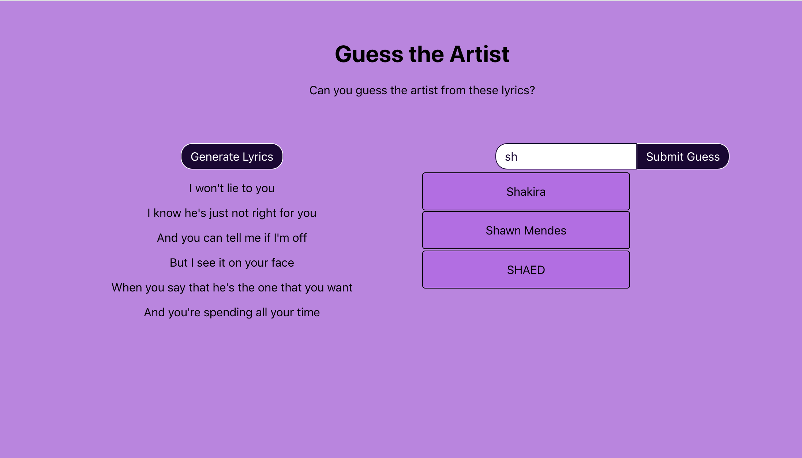

## Guess the Artist 🤔

A game where the user will be given a snippet of random lyrics and the aim is to guess who the artist of the song is. It has two states, Correct 😀 or Incorrect 😄.

Implemented an autocomplete component for looking up artist name.

Live link: https://liyasileshi.github.io/lyrics/




## Getting Started 🚀

These instructions will get you a copy of the project up and running on your local machine for development and testing purposes.

### Prerequisites ✨

- React
- JavaScript knowledge
- CSS 
- SCSS

### Installing 📲

> To get started...


- **Option 1**
    - 🍴 Fork this repo!

- **Option 2**
    - 👯 Clone this repo to your local machine using `https://github.com/liyaSileshi/lyrics.git`

### Quick Start 🎬

Get up and running with Lyrics app:

1. Once you have the repo cloned and met all the requirements above, start the
packager that will transform your JS code on-the-fly:
```
npm install
npm start
```

## Built With 🏗

* [React](https://reactjs.org/)
* CSS
* SCSS
* JavaScript

## Authors 🇪🇹

* **Liya Tilahun** 
